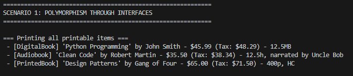
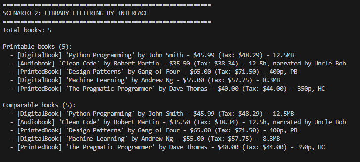
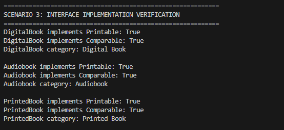
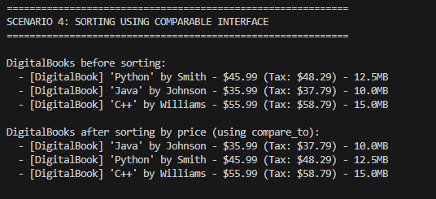
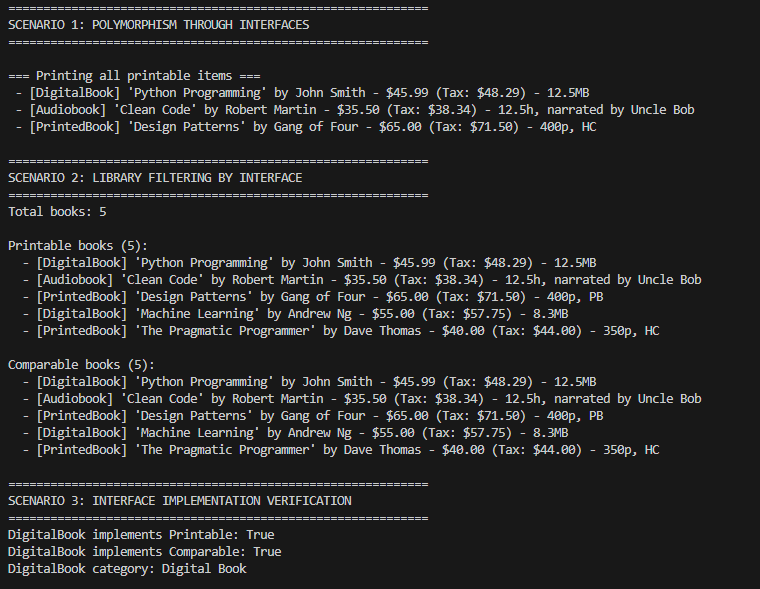
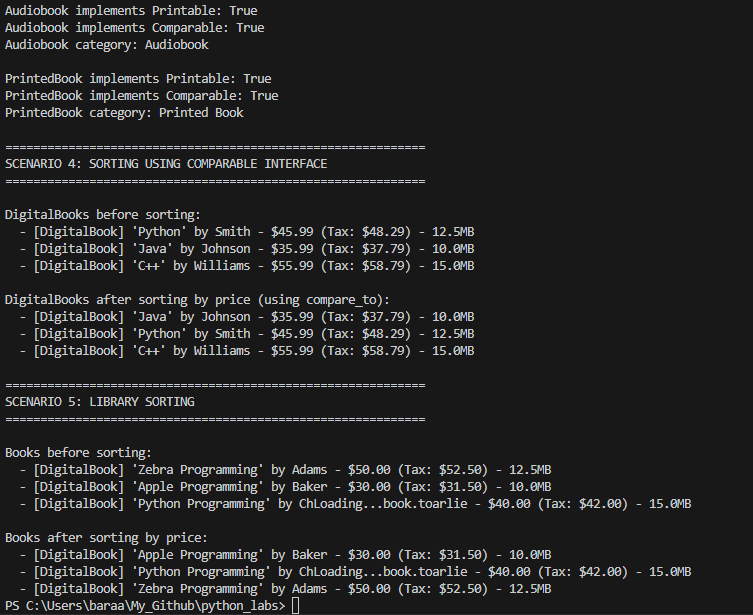

# Laboratory Work No. 4: Interfaces and Abstract Classes (ABC)

## 1. Objective

In this laboratory work, the following concepts were studied:

- Abstract Base Classes (ABC) in Python
- Interfaces as behavior contracts
- Polymorphism through a unified interface
- Multiple interface inheritance
- Collection filtering by interface type
- Using interfaces as data types

---

## 2. Interface Description

The following interfaces (ABC) were created in `interfaces.py`:

| Interface | Method | Description |
|-----------|--------|-------------|
| Printable | to_string() | Returns a formatted string representation of the object |
| Comparable | compare_to(other) | Compares objects: -1 (less), 0 (equal), 1 (greater) |
| Categorizable | get_category() | Returns the category/type of the object |

### Interface Definitions

```python
from abc import ABC, abstractmethod

class Printable(ABC):
    @abstractmethod
    def to_string(self) -> str:
        pass

class Comparable(ABC):
    @abstractmethod
    def compare_to(self, other) -> int:
        pass

class Categorizable(ABC):
    @abstractmethod
    def get_category(self) -> str:
        pass
```

## 3. Implementation in Classes

The following classes implement the created interfaces:

| Class         | Printable | Comparable | Categorizable | Comparison Logic        |
|--------------|----------|------------|---------------|------------------------|
| DigitalBook  | Yes      | Yes        | Yes           | Compares by price      |
| Audiobook    | Yes      | Yes        | Yes           | Compares by duration   |
| PrintedBook  | Yes      | Yes        | Yes           | Compares by page count |

---

## Different Behavior of Methods

| Method         | DigitalBook                                      | Audiobook                                      | PrintedBook                                      |
|----------------|--------------------------------------------------|------------------------------------------------|--------------------------------------------------|
| to_string()    | Returns digital book format with file size       | Returns audiobook format with narrator         | Returns printed book format with cover type      |
| compare_to()   | Compares by price                                | Compares by duration (hours)                   | Compares by page count                           |
| get_category() | Returns "Digital Book"                           | Returns "Audiobook"                            | Returns "Printed Book"                           |


## 4. Demonstration

Scenario 1: Polymorphism through Interface

```python
def print_all(items: list[Printable]) -> None:
    print("\n=== Printing all printable items ===")
    for item in items:
        print(f"  -> {item.to_string()}")

digital = DigitalBook("Python Programming", "John Smith", 45.99, 500, 12.5, "PDF")
audio = Audiobook("Clean Code", "Robert Martin", 35.50, 450, 12.5, "Uncle Bob")
printed = PrintedBook("Design Patterns", "Gang of Four", 65.00, 400, 850, True)

printable_items: list[Printable] = [digital, audio, printed]
print_all(printable_items)
```

Output:



Scenario 2: Collection Filtering by Interface

```python
class Library:
    def get_printable(self) -> List[Printable]:
        return [book for book in self._items if isinstance(book, Printable)]
    
    def get_comparable(self) -> List[Comparable]:
        return [book for book in self._items if isinstance(book, Comparable)]

library = Library()
library.add(DigitalBook("Python", "Smith", 45.99, 500, 12.5))
library.add(Audiobook("Clean Code", "Martin", 35.50, 450, 12.5, "Bob"))
library.add(PrintedBook("Design Patterns", "Gang of Four", 65.00, 400, 850))

print(f"Total books: {len(library)}")
print(f"Printable books: {len(library.get_printable())}")
print(f"Comparable books: {len(library.get_comparable())}")
```

Output:



Scenario 3: Interface Verification with isinstance()

```python
digital = DigitalBook("AI Basics", "Jane Doe", 30.00, 300, 5.2)
audio = Audiobook("The Hobbit", "J.R.R. Tolkien", 25.00, 350, 10.0, "Andy Serkis")
printed = PrintedBook("1984", "George Orwell", 15.00, 328, 400)

print(f"DigitalBook implements Printable: {isinstance(digital, Printable)}")
print(f"DigitalBook implements Comparable: {isinstance(digital, Comparable)}")
print(f"DigitalBook category: {digital.get_category()}")

print(f"\nAudiobook implements Printable: {isinstance(audio, Printable)}")
print(f"Audiobook implements Comparable: {isinstance(audio, Comparable)}")
print(f"Audiobook category: {audio.get_category()}")

print(f"\nPrintedBook implements Printable: {isinstance(printed, Printable)}")
print(f"PrintedBook implements Comparable: {isinstance(printed, Comparable)}")
print(f"PrintedBook category: {printed.get_category()}")
```

Output:



Scenario 4: Sorting with Comparable Interface

```python
import functools

def compare_books(a, b):
    return a.compare_to(b)

books = [
    DigitalBook("Python", "Smith", 45.99, 500, 12.5),
    DigitalBook("Java", "Johnson", 35.99, 400, 10.0),
    DigitalBook("C++", "Williams", 55.99, 600, 15.0),
]

print("Before sorting:")
for book in books:
    print(f"  - {book.title}: ${book.price}")

sorted_books = sorted(books, key=functools.cmp_to_key(compare_books))

print("\nAfter sorting by price:")
for book in sorted_books:
    print(f"  - {book.title}: ${book.price}")
```

Output:



### Program Output (Full Demo)



### Project Structure

```
python_labs/
├── README.md
├── src/
│   └── lib/
│       ├── lab01/
│       ├── lab02/
│       ├── lab03/
│       └── lab04/
│           ├── interfaces.py
│           ├── models.py
│           ├── library.py
│           └── demo.py
└── images/
    └── lab04/
        └── screenshots.png
```