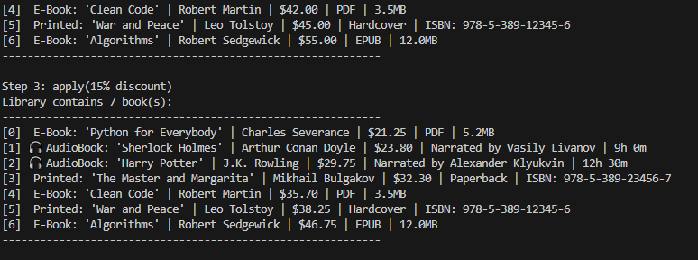
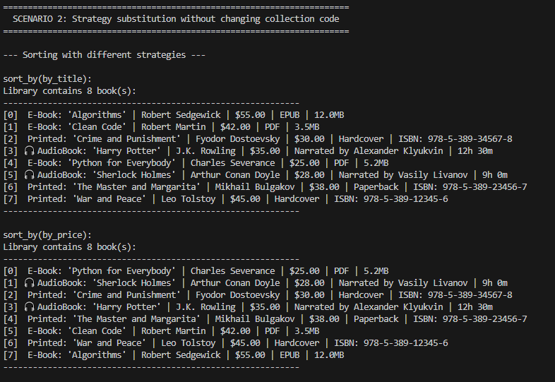
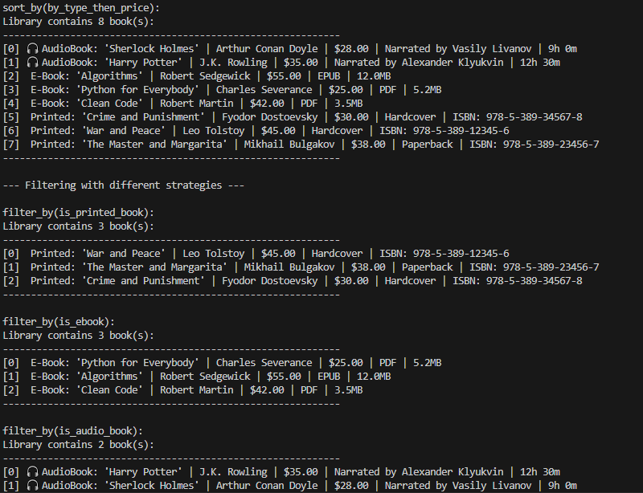
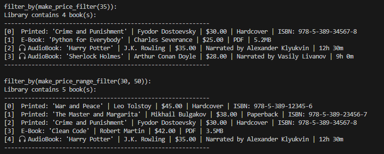
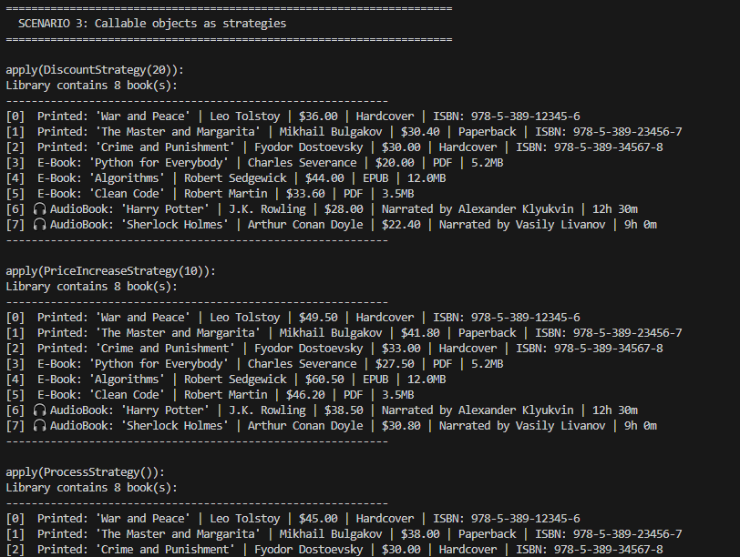
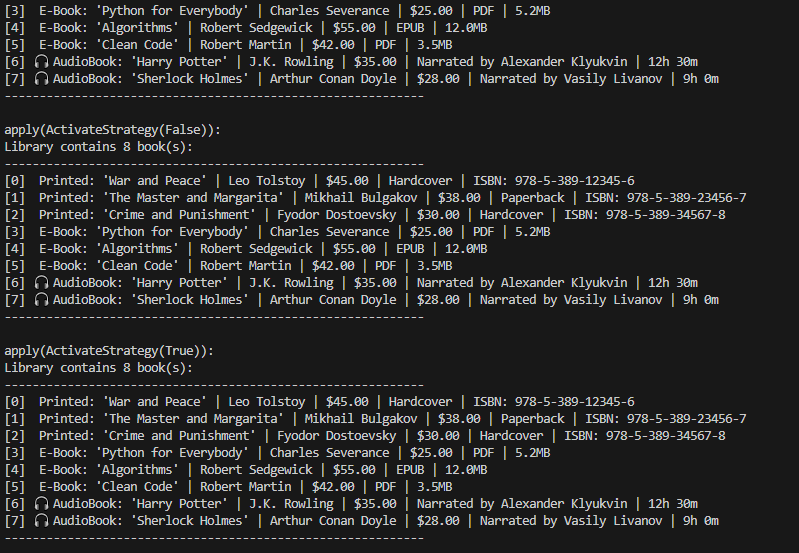
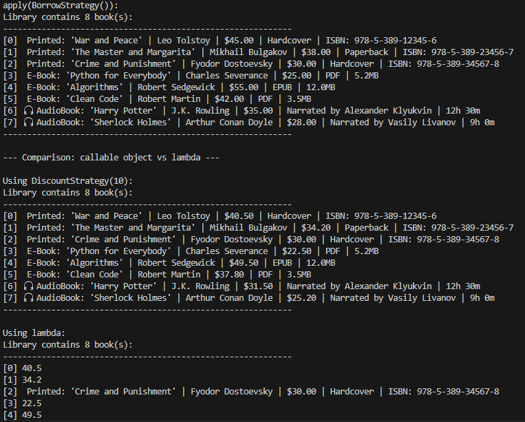
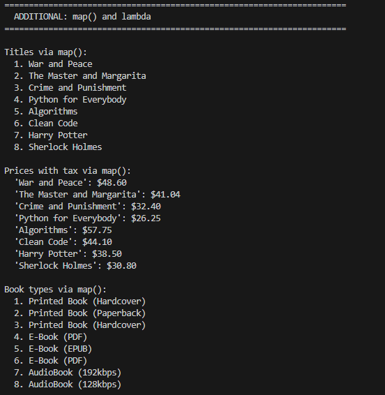
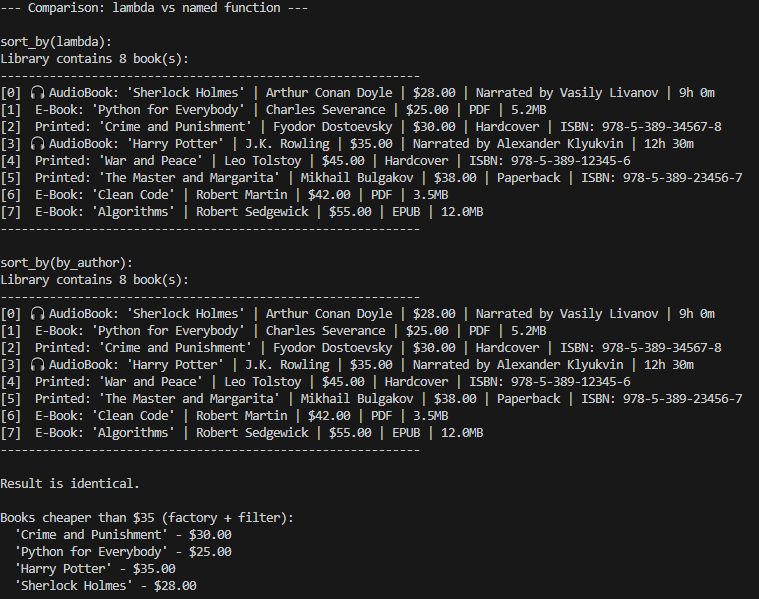

# Laboratory Work #5: Functions as Arguments. Strategies and Delegates

## 1. Purpose of the Work

- Master passing functions as arguments to other functions and methods.
- Learn to use built-in higher-order functions: map, filter, sorted.
- Understand the "Strategy" pattern concept and implement it in Python.
- Master lambda expressions and their practical application.
- Integrate functional style with object-oriented code from previous labs.

## 2. Implemented Functions and Strategies

### 2.1 Sorting Strategies

| Function | Description |
|----------|-------------|
| by_title | Sort by book title (case insensitive) |
| by_price | Sort by book price |
| by_author | Sort by author name |
| by_price_then_title | Sort by price, then by title |
| by_type_then_price | Sort by book type, then by price |

### 2.2 Filtering Strategies

| Function | Description |
|----------|-------------|
| is_available | Filter available books |
| is_printed_book | Filter PrintedBook objects (isinstance) |
| is_ebook | Filter EBook objects (isinstance) |
| is_audio_book | Filter AudioBook objects (isinstance) |

### 2.3 Function Factories

| Factory | Created Function |
|---------|------------------|
| make_price_filter(max_price) | Filter by maximum price |
| make_price_range_filter(min, max) | Filter by price range |
| make_discount_func(percent) | Function applying discount |

### 2.4 Callable Objects (Strategy Pattern)

| Class | Purpose |
|-------|---------|
| DiscountStrategy | Apply discount to books |
| PriceIncreaseStrategy | Increase book prices |
| ProcessStrategy | Process books |
| ActivateStrategy | Change book availability |
| BorrowStrategy | Borrow books |
| ReturnStrategy | Return books |

### 2.5 Library Collection Methods

| Method | Description |
|--------|-------------|
| sort_by(key_func) | Sort using strategy function |
| filter_by(predicate) | Filter using predicate function |
| apply(func) | Apply function to all elements |

## 3. Demonstration of Work

### Scenario 1: Complete Chain filter -> sort -> apply

The scenario demonstrates filtering available books, sorting by price and title, then applying a 15% discount to all books.

### Scenario 2: Strategy Substitution Without Changing Collection Code

The scenario shows that the same collection can be sorted and filtered using different strategies without modifying the Library class code. Different sorting strategies (by_title, by_price, by_type_then_price) and filtering strategies (by type, by price range) are applied.

### Scenario 3: Callable Objects as Strategies

The scenario demonstrates the use of callable objects (DiscountStrategy, PriceIncreaseStrategy, ProcessStrategy, ActivateStrategy, BorrowStrategy, ReturnStrategy) and compares them with lambda expressions.

### Additional: map() and lambda

Demonstration of map() function for extracting titles, calculating prices with tax, and getting book types. Comparison between lambda expressions and named functions.

## 4. Conclusion

During this laboratory work, the following topics were studied:
- Passing functions as arguments.
- Lambda expressions, map, filter.
- Higher-order functions and closures.
- The Strategy pattern through callable objects.
- Method chaining for collection processing.